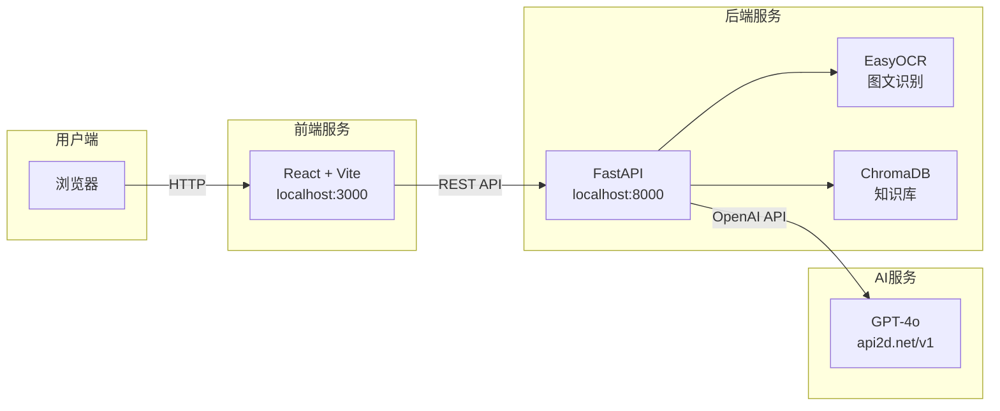
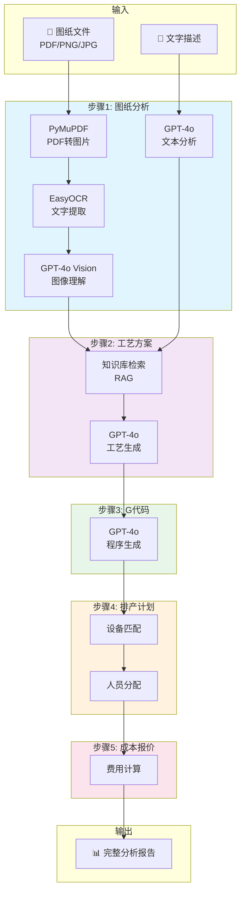
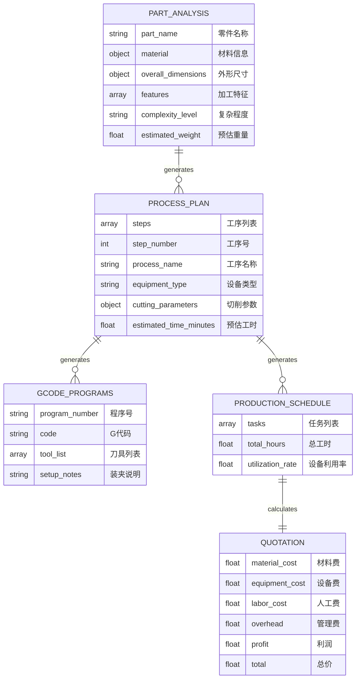
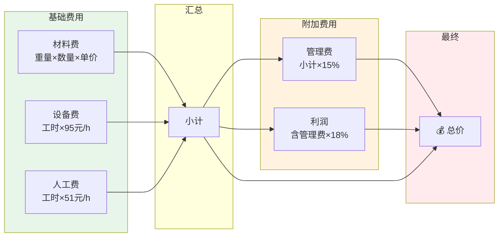
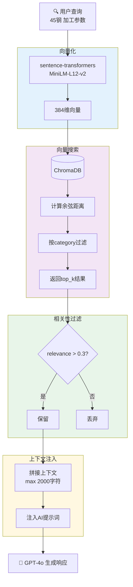
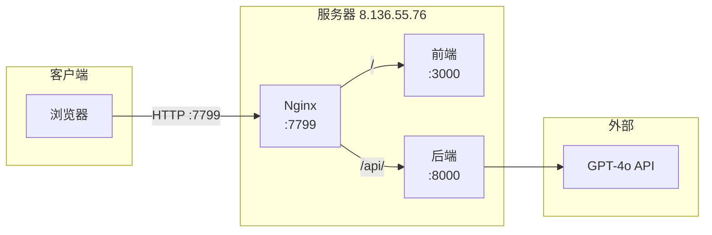

# 智能制造工艺分析系统 - 技术文档

> 版本: 1.0  
> 更新日期: 2025-12-11  
> 公司: 隆而法液压

---

## 一、系统概述

本系统是一个基于 AI 的智能制造工艺分析平台，能够自动分析机械零件图纸，生成工艺方案、G 代码、排产计划和成本报价。

### 技术栈

| 层级     | 技术                       |
| -------- | -------------------------- |
| 前端     | React + Vite + TailwindCSS |
| 后端     | Python FastAPI             |
| AI 模型  | GPT-4o (文本+视觉)         |
| OCR      | EasyOCR (中英文)           |
| PDF 解析 | PyMuPDF                    |

---

## 二、系统架构



---

## 三、核心流程

### 3.1 完整分析流程



### 3.2 各步骤输出数据



---

## 四、API 接口

### 4.1 流式分析接口

```
POST /api/analysis/stream
Content-Type: multipart/form-data
```

**请求参数:**

| 参数        | 类型   | 必填 | 说明                       |
| ----------- | ------ | ---- | -------------------------- |
| file        | File   | 否   | 图纸文件 (PDF/PNG/JPG)     |
| description | string | 否   | 零件文字描述               |
| quantity    | int    | 否   | 生产数量，默认 1           |
| priority    | string | 否   | 优先级 (urgent/normal/low) |
| due_date    | string | 否   | 交货日期                   |
| customer    | string | 否   | 客户名称                   |

**响应:** Server-Sent Events (SSE) 流

### 4.2 资源配置接口

```
GET /api/resources/
```

返回公司设备、人员、材料价格等配置信息。

---

## 五、配置文件

### 5.1 环境配置 (.env)

```bash
# AI配置
MISTRAL_API_KEY=your_api_key
MISTRAL_BASE_URL=https://oa.api2d.net/v1
MISTRAL_MODEL=gpt-4o
VISION_MODEL=gpt-4o

# 服务器配置
HOST=0.0.0.0
PORT=8000

# 公司配置
COMPANY_CONFIG_PATH=./config/company_resources.json
```

### 5.2 公司资源配置 (company_resources.json)

```json
{
  "company_name": "隆而法液压",
  "equipment": [
    {
      "id": "CNC-001",
      "name": "数控车床-1号",
      "type": "CNC_LATHE",
      "hourly_rate": 85
    }
  ],
  "personnel": [
    {
      "id": "OP-001",
      "name": "张师傅",
      "skills": ["车削"],
      "hourly_rate": 55
    }
  ],
  "material_costs": {
    "45钢": 6.0,
    "304不锈钢": 18.0
  },
  "overhead_rate": 0.15,
  "profit_rate": 0.18
}
```

---

## 六、报价计算公式



**计算公式:**

```
材料费 = 零件重量(kg) × 数量 × 材料单价(元/kg)
设备费 = 总工时(h) × 平均设备费率(元/h)
人工费 = 总工时(h) × 平均人工费率(元/h)
小计 = 材料费 + 设备费 + 人工费
管理费 = 小计 × 管理费率(15%)
利润 = (小计 + 管理费) × 利润率(18%)
总价 = 小计 + 管理费 + 利润
```

### 当前费率配置

| 项目     | 费率            | 来源                   |
| -------- | --------------- | ---------------------- |
| 设备费率 | ~95 元/h (平均) | company_resources.json |
| 人工费率 | ~51 元/h (平均) | company_resources.json |
| 管理费率 | 15%             | company_resources.json |
| 利润率   | 18%             | company_resources.json |

---

## 七、数据清洗

系统会自动处理 AI 返回的无效数据：

```python
# 自动转换为0的无效值
'-', '--', 'N/A', 'n/a', '', '无', '—'

# 处理的数值字段
dimensions, overall_dimensions, blank_dimensions,
total_hours, utilization_rate, estimated_time_minutes,
duration_minutes, estimated_weight, total_time_minutes,
material_cost, equipment_cost, labor_cost, ...
```

---

## 八、启动方式

### 一键启动

```bash
cd /path/to/MistralAiFactory
sh start.sh
```

脚本会自动：

1. 停止旧服务 (端口 8000, 3000, 3001)
2. 启动前端 (后台)
3. 启动后端 (前台显示日志)

### 访问地址

| 服务     | 地址                       |
| -------- | -------------------------- |
| 前端     | http://localhost:3000      |
| 后端 API | http://localhost:8000      |
| API 文档 | http://localhost:8000/docs |

---

## 九、目录结构

```
MistralAiFactory/
├── backend/
│   ├── app/
│   │   ├── core/           # 配置
│   │   ├── models/         # 数据模型
│   │   ├── routers/        # API路由
│   │   └── services/       # 业务逻辑
│   │       ├── mistral_service.py    # AI服务
│   │       ├── analysis_service.py   # 分析服务
│   │       └── knowledge_service.py  # 知识库
│   ├── config/
│   │   └── company_resources.json    # 公司资源配置
│   ├── knowledge_base/     # 知识库文件
│   ├── .env                # 环境配置
│   └── run.py              # 启动入口
├── frontend/
│   ├── src/
│   └── package.json
├── start.sh                # 一键启动脚本
└── docs/
    └── 技术文档.md          # 本文档
```

---

## 十、知识库检索机制

### 10.1 四大知识库

| 分类       | 代码标识      | 说明               |
| ---------- | ------------- | ------------------ |
| 刀具库     | tool          | 刀具选型、切削参数 |
| 工艺路线库 | process_route | 标准加工工艺流程   |
| 工时成本库 | cost          | 工时估算参考       |
| 特征信息库 | feature       | 几何特征加工方法   |

### 10.2 检索流程



### 10.3 技术栈

| 组件       | 技术                                |
| ---------- | ----------------------------------- |
| 向量数据库 | ChromaDB (本地持久化)               |
| 嵌入模型   | sentence-transformers               |
| 存储位置   | `backend/knowledge_base/chroma_db/` |

### 10.4 调用示例

```python
from app.services.knowledge_service import knowledge_service

# 搜索知识
results = knowledge_service.search("45钢 车削参数", category="material", top_k=5)

# 获取 RAG 上下文
context = knowledge_service.get_context_for_query("铝合金 加工", max_chars=1500)

# 添加新知识
knowledge_service.add_document(
    content="40Cr合金钢，硬度HRC28-32...",
    category="material",
    title="40Cr钢加工参数"
)
```

### 10.5 默认知识

系统预置知识包括：

- **材料**: 45 号钢、铝合金 6061、不锈钢 304 切削参数
- **工艺**: 轴类零件加工工艺、孔加工工艺选择
- **标准**: GB/T 1804 一般公差、表面粗糙度 Ra 选用

### 10.6 知识库扩展指南

#### 10.6.1 知识分类与准备

| 分类       | 代码标识      | 需要准备的内容                       | 示例                                               |
| ---------- | ------------- | ------------------------------------ | -------------------------------------------------- |
| 刀具库     | tool          | 刀具型号、适用材料、切削参数、寿命   | "T10 硬质合金刀片，适用 45 钢，车削速度 120m/min"  |
| 工艺路线库 | process_route | 典型零件工艺流程、工序顺序、注意事项 | "法兰盘加工：下料 → 车端面 → 车外圆 → 钻孔 → 攻丝" |
| 工时成本库 | cost          | 各工序标准工时、设备费率、人工费率   | "φ50 外圆精车，标准工时 0.5h/件"                   |
| 特征信息库 | feature       | 几何特征识别、加工方法、精度要求     | "键槽：铣削加工，宽度公差 ±0.02"                   |

#### 10.6.2 知识格式要求

```python
{
    "title": "知识标题（简短描述）",
    "content": "详细内容（结构化文本，包含具体数值）",
    "category": "分类标识（tool/process_route/cost/feature）",
    "metadata": {  # 可选
        "material": "适用材料",
        "equipment": "适用设备",
        "source": "来源"
    }
}
```

#### 10.6.3 推荐补充的知识

**材料切削参数（优先级高）：**

- 40Cr 合金钢、DT4 电工纯铁、GCR15 轴承钢
- 黄铜 H62、紫铜 T2
- 每种材料需要：密度、硬度、粗/精加工切削参数、热处理建议

**典型零件工艺（优先级高）：**

- 液压阀体、液压缸筒、活塞杆、端盖、法兰盘

**工时定额（优先级中）：**

- 数控车床：外圆、端面、螺纹工时
- 加工中心：铣平面、钻孔、攻丝工时
- 磨床：外圆磨、内圆磨工时

#### 10.6.4 添加知识方法

**方法一：代码直接添加**

```python
from app.services.knowledge_service import knowledge_service

knowledge_service.add_document(
    content="""40Cr合金钢加工参数
硬度：HRC28-32（调质后）
密度：7.87 g/cm³
推荐切削参数：
- 粗车：切削速度70-100m/min，进给0.2-0.4mm/r，切深1.5-3mm
- 精车：切削速度100-140m/min，进给0.1-0.2mm/r，切深0.3-0.8mm
热处理：调质处理，淬火+高温回火
适用：齿轮轴、传动轴、高强度螺栓""",
    category="material",
    title="40Cr合金钢加工参数"
)
```

**方法二：批量导入 JSON 文件**

创建 `backend/knowledge_base/custom_knowledge.json`：

```json
[
  {
    "title": "液压阀体加工工艺",
    "category": "process_route",
    "content": "液压阀体标准加工流程：\n1. 毛坯：铸件或锻件\n2. 粗铣六面\n3. 精铣基准面\n4. 钻油道孔\n5. 铰阀孔（IT7精度）\n6. 攻螺纹\n7. 去毛刺\n8. 清洗\n关键控制：阀孔同轴度≤0.02，表面粗糙度Ra0.8"
  }
]
```

#### 10.6.5 验证知识有效性

```python
# 测试检索
results = knowledge_service.search("40Cr 车削参数", top_k=3)
for r in results:
    print(f"相关性: {r['relevance']:.2f} - {r['metadata']['title']}")
```

#### 10.6.6 数据收集来源

| 来源         | 内容                         |
| ------------ | ---------------------------- |
| 公司工艺文件 | 历史工艺卡、作业指导书       |
| 设备手册     | 各机床加工参数范围           |
| 刀具目录     | 刀具厂家推荐参数             |
| 切削手册     | 《机械加工工艺手册》标准参数 |
| 工时定额     | 公司内部工时定额标准         |
| 质量记录     | 典型问题及解决方案           |

---

## 十一、服务器部署

### 11.1 服务器信息

| 项目      | 值                       |
| --------- | ------------------------ |
| 服务器 IP | 8.136.55.76              |
| SSH 端口  | 22                       |
| 用户      | root                     |
| 应用目录  | /opt/mistral-factory     |
| 日志目录  | /var/log/mistral-factory |

### 11.2 部署架构



### 11.3 一键部署

```bash
# 运行部署脚本
cd deploy
./deploy_server.sh
```

**部署菜单:**

```
1) 完整部署 (首次部署)
2) 更新代码并重启
3) 仅重启服务
4) 停止服务
5) 查看实时日志 (后端)
6) 查看实时日志 (前端)
7) 查看实时日志 (Nginx)
8) 查看服务状态
9) SSH 登录服务器
```

### 11.4 Nginx 配置

配置文件: `/etc/nginx/conf.d/mistral-factory.conf`

```nginx
# 前端
location / {
    proxy_pass http://127.0.0.1:3000;
}

# 后端 API (支持 SSE 流式响应)
location /api/ {
    proxy_pass http://127.0.0.1:8000;
    proxy_buffering off;  # SSE 必须
}
```

### 11.5 Systemd 服务

```bash
# 后端服务
systemctl status mistral-backend
systemctl restart mistral-backend

# 前端服务
systemctl status mistral-frontend
systemctl restart mistral-frontend
```

### 11.6 日志查看

```bash
# 后端日志
tail -f /var/log/mistral-factory/backend.log

# 前端日志
tail -f /var/log/mistral-factory/frontend.log

# Nginx 日志
tail -f /var/log/nginx/mistral-factory-access.log
```

### 11.7 访问地址

| 服务     | 地址                         |
| -------- | ---------------------------- |
| 前端     | http://8.136.55.76:7799      |
| API      | http://8.136.55.76:7799/api/ |
| API 文档 | http://8.136.55.76:7799/docs |

---

## 十二、常见问题

### Q1: 报错 "could not convert string to float: '-'"

**原因:** AI 返回的 JSON 中有无效值 `-`

**解决:** 系统已内置 `_sanitize_dimensions` 函数自动处理

### Q2: 端口被占用

**解决:** 使用 `start.sh` 启动，会自动清理旧进程

### Q3: 报价偏高

**检查:** 确认 `company_resources.json` 中的费率配置是否正确

---

## 十一、后续优化方向

1. **Prompt 优化** - 强调数值格式要求，减少无效值
2. **缓存机制** - 相同零件分析结果缓存
3. **批量处理** - 支持多零件批量分析
4. **历史记录** - 分析结果持久化存储
5. **权限管理** - 多用户访问控制
