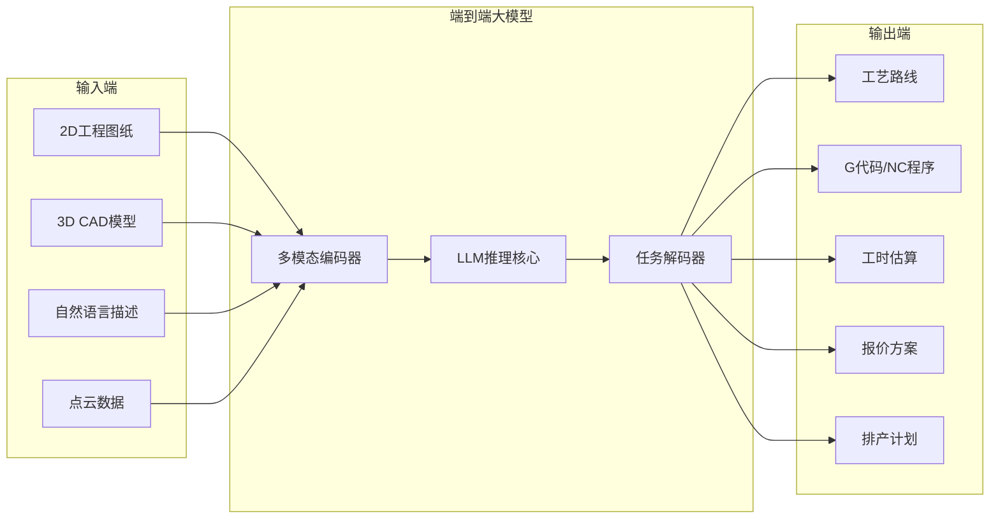
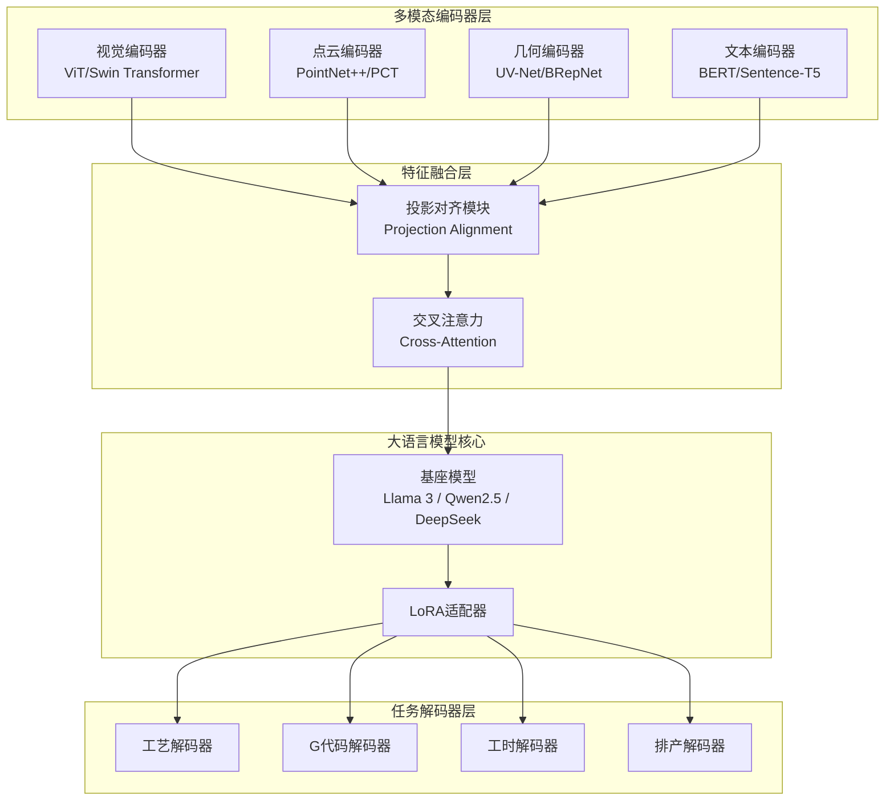
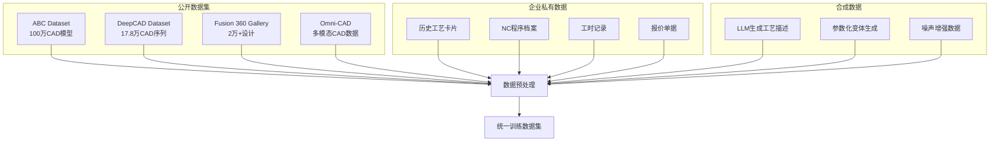
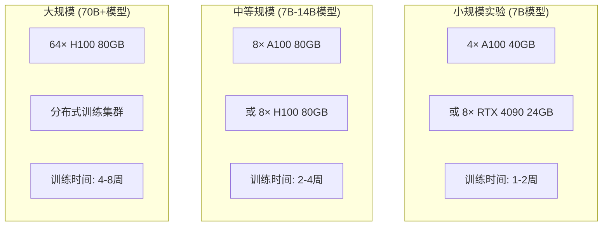
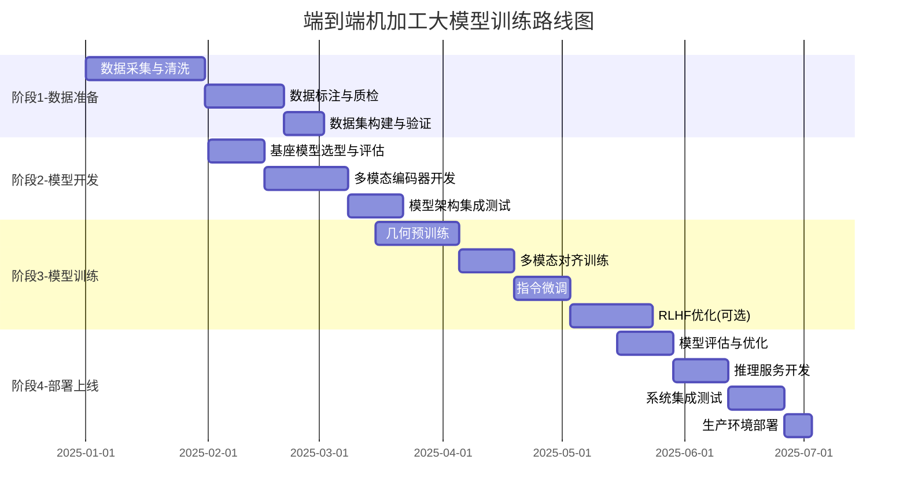

# 端到端机加工大模型训练方案

## 1. 概述

端到端机加工大模型是一种能够从工程图纸/3D 模型直接生成加工工艺、G 代码和排产计划的多模态 AI 系统。本文档详细介绍训练此类模型的技术路线、数据需求、架构选型和实施步骤。



---

## 2. 技术架构

### 2.1 整体架构设计



### 2.2 核心组件选型

| 组件              | 推荐模型                      | 参数量        | 特点                         |
| ----------------- | ----------------------------- | ------------- | ---------------------------- |
| **视觉编码器**    | Swin Transformer V2           | 197M          | 多尺度特征提取，适合工程图纸 |
| **3D 几何编码器** | UV-Net / BRepNet              | 50-100M       | 理解 B-Rep 拓扑结构          |
| **点云编码器**    | Point Cloud Transformer (PCT) | 30M           | 处理扫描点云数据             |
| **基座 LLM**      | Qwen2.5-7B / Llama3-8B        | 7-8B          | 中文能力强，推理效率高       |
| **微调方法**      | LoRA / QLoRA                  | 0.1-1% params | 高效微调，显存友好           |

---

## 3. 训练数据体系

### 3.1 数据类型与来源



### 3.2 数据集详细说明

#### 3.2.1 公开数据集

| 数据集                 | 规模         | 内容                     | 获取方式                                                                                                     |
| ---------------------- | ------------ | ------------------------ | ------------------------------------------------------------------------------------------------------------ |
| **ABC Dataset**        | 100 万模型   | B-Rep CAD 模型、曲面法线 | [deep-geometry.github.io/abc-dataset](https://deep-geometry.github.io/abc-dataset/)                          |
| **DeepCAD**            | 178,238 模型 | CAD 操作序列 (草图+拉伸) | [github.com/ChrisWu1997/DeepCAD](https://github.com/ChrisWu1997/DeepCAD)                                     |
| **Fusion 360 Gallery** | 20,000+设计  | 完整设计历史、装配体     | [github.com/AutodeskAILab/Fusion360GalleryDataset](https://github.com/AutodeskAILab/Fusion360GalleryDataset) |
| **Omni-CAD**           | 多模态       | 文本-图像-点云-CAD 对齐  | [huggingface.co/datasets/jingwei-xu-00/Omni-CAD](https://huggingface.co/datasets/jingwei-xu-00/Omni-CAD)     |
| **SketchGraphs**       | 1500 万草图  | 约束关系图               | [github.com/PrincetonLIPS/SketchGraphs](https://github.com/PrincetonLIPS/SketchGraphs)                       |

#### 3.2.2 私有数据构建

```yaml
# 数据采集清单
工艺数据:
  - 工艺路线卡: 工序、设备、刀具、切削参数
  - 工艺规程: 加工方法、装夹方式、检测要求
  - 标准工时: 准备时间、加工时间、辅助时间

NC数据:
  - G代码程序: 主程序、子程序、宏程序
  - 刀具轨迹: 走刀路径、进退刀方式
  - 加工参数: 转速、进给、切深、切宽

图纸数据:
  - 2D工程图: DWG/DXF/PDF格式
  - 3D模型: STEP/IGES/Parasolid格式
  - 技术要求: 公差、表面粗糙度、热处理

业务数据:
  - 报价记录: 材料成本、加工费、外协费
  - 工时实绩: 实际加工时间、返工时间
  - 质量记录: 不合格项、返修方案
```

### 3.3 数据标注格式

```json
{
  "id": "part_001",
  "input": {
    "image": "drawings/part_001.png",
    "cad_file": "models/part_001.step",
    "point_cloud": "points/part_001.ply",
    "text_description": "材料45钢，外圆φ50，长度100mm，表面粗糙度Ra1.6"
  },
  "output": {
    "process_route": [
      { "op": 10, "name": "下料", "equipment": "带锯床", "time_min": 5 },
      { "op": 20, "name": "车削", "equipment": "数控车床", "time_min": 15 },
      { "op": 30, "name": "铣削", "equipment": "加工中心", "time_min": 25 },
      { "op": 40, "name": "热处理", "equipment": "热处理炉", "time_min": 120 },
      { "op": 50, "name": "磨削", "equipment": "外圆磨床", "time_min": 20 }
    ],
    "g_code": "O0001\nG21 G90 G54\nT01 M06\nS1200 M03\n...",
    "estimated_hours": 3.08,
    "quote": {
      "material_cost": 45.0,
      "machining_cost": 185.0,
      "total": 230.0
    }
  },
  "metadata": {
    "material": "45钢",
    "complexity": "medium",
    "tolerance_grade": "IT7"
  }
}
```

---

## 4. 模型训练流程

### 4.1 训练阶段划分


### 4.2 详细训练配置

#### 阶段 1: 几何预训练 (2-4 周)

```python
# 预训练配置
pretrain_config = {
    "task": "CAD序列自回归预测",
    "base_model": "Transformer Encoder-Decoder",
    "dataset": "DeepCAD + ABC",
    "batch_size": 256,
    "learning_rate": 1e-4,
    "warmup_steps": 10000,
    "total_steps": 500000,
    "optimizer": "AdamW",
    "scheduler": "cosine",
    "hardware": "8x A100 80GB",
    "training_time": "~2 weeks"
}

# 预训练任务
tasks = [
    "CAD序列补全",      # 给定前缀，预测后续操作
    "草图重建",         # 从噪声草图恢复原始草图
    "特征识别",         # 识别加工特征类型
    "拓扑推理"          # 预测面-边-点关系
]
```

#### 阶段 2: 多模态对齐 (1-2 周)

```python
# 对齐训练配置
alignment_config = {
    "task": "对比学习 + 生成对齐",
    "loss": "InfoNCE + Cross-Entropy",
    "modalities": ["image", "text", "point_cloud", "cad_sequence"],
    "projection_dim": 768,
    "temperature": 0.07,
    "batch_size": 128,
    "learning_rate": 5e-5,
    "epochs": 50,
    "freeze_encoders": False,  # 可选冻结预训练编码器
}

# 对齐数据格式
alignment_data = {
    "positive_pairs": [
        ("image_of_part", "cad_model_of_same_part"),
        ("text_description", "cad_model"),
        ("point_cloud", "cad_model")
    ],
    "hard_negatives": "in-batch negatives + mined hard negatives"
}
```

#### 阶段 3: 指令微调 (1-2 周)

```python
# LoRA微调配置
lora_config = {
    "base_model": "Qwen2.5-7B-Instruct",
    "lora_r": 64,
    "lora_alpha": 128,
    "lora_dropout": 0.05,
    "target_modules": ["q_proj", "k_proj", "v_proj", "o_proj",
                       "gate_proj", "up_proj", "down_proj"],
    "batch_size": 4,
    "gradient_accumulation": 8,
    "learning_rate": 2e-4,
    "epochs": 3,
    "max_seq_length": 4096,
    "hardware": "4x A100 40GB"
}

# 指令数据格式示例
instruction_examples = [
    {
        "instruction": "根据以下零件图纸，生成加工工艺路线",
        "input": "<image>part_drawing.png</image>\n材料：45钢，批量：100件",
        "output": "工艺路线：下料→车削→铣削→钻孔→热处理→磨削→检验..."
    },
    {
        "instruction": "生成以下特征的数控车削程序",
        "input": "外圆φ50×80，材料45钢，精度IT7，Ra1.6",
        "output": "O0001\nG21 G90 G54\nT0101\nG96 S180 M03\n..."
    },
    {
        "instruction": "估算该零件的加工工时",
        "input": "<cad>part.step</cad>\n工序：粗车+精车+铣槽",
        "output": "准备时间：15min\n粗车：8min\n精车：12min\n铣槽：6min\n总计：41min"
    }
]
```

#### 阶段 4: RLHF 优化 (可选, 2-4 周)

```python
# RLHF配置
rlhf_config = {
    "reward_model": "基于工艺专家偏好训练",
    "algorithm": "PPO",
    "kl_coef": 0.1,
    "clip_range": 0.2,
    "value_loss_coef": 0.5,
    "num_rollouts": 128,
    "ppo_epochs": 4
}

# 奖励信号来源
reward_signals = [
    "工艺可行性评分 (专家标注)",
    "G代码语法正确性 (自动验证)",
    "工时估算准确度 (与实际对比)",
    "加工成本合理性 (历史数据校验)"
]
```

---

## 5. 开源基座模型推荐

### 5.1 大语言模型基座

| 模型            | 参数量   | 许可证     | 中文能力   | 推荐场景           |
| --------------- | -------- | ---------- | ---------- | ------------------ |
| **Qwen2.5**     | 0.5B-72B | Apache 2.0 | ⭐⭐⭐⭐⭐ | 首选，中文优秀     |
| **Llama 3.1**   | 8B-405B  | Llama 3.1  | ⭐⭐⭐     | 英文为主场景       |
| **DeepSeek-V2** | 16B-236B | MIT        | ⭐⭐⭐⭐   | MoE 架构，推理高效 |
| **Yi-1.5**      | 6B-34B   | Apache 2.0 | ⭐⭐⭐⭐   | 长上下文支持       |
| **InternLM2.5** | 7B-20B   | Apache 2.0 | ⭐⭐⭐⭐   | 工具调用能力强     |

### 5.2 多模态基座

| 模型            | 类型     | 参数量 | 特点               |
| --------------- | -------- | ------ | ------------------ |
| **Qwen-VL-Max** | 视觉语言 | 72B    | 图纸理解能力强     |
| **LLaVA-1.6**   | 视觉语言 | 7B-34B | 开源友好，易于微调 |
| **InternVL2**   | 视觉语言 | 2B-76B | 高分辨率图像支持   |
| **CogVLM2**     | 视觉语言 | 19B    | 视觉定位能力强     |

### 5.3 CAD 专用模型

| 模型         | 任务            | 来源           | 开源状态    |
| ------------ | --------------- | -------------- | ----------- |
| **DeepCAD**  | CAD 序列生成    | Columbia Univ. | ✅ 开源     |
| **CAD-MLLM** | 多模态 CAD 生成 | ShanghaiTech   | 🔜 即将开源 |
| **CadVLM**   | 草图生成        | Autodesk       | 📄 论文公开 |
| **UV-Net**   | B-Rep 特征学习  | Autodesk       | ✅ 开源     |
| **BRepNet**  | B-Rep 分类      | Autodesk       | ✅ 开源     |

---

## 6. 硬件与基础设施

### 6.1 训练硬件需求



### 6.2 推荐配置

| 规模     | GPU 配置     | 显存需求 | 存储      | 预算参考         |
| -------- | ------------ | -------- | --------- | ---------------- |
| **入门** | 4× RTX 4090  | 96GB     | 2TB NVMe  | ¥15-20 万        |
| **标准** | 8× A100 40GB | 320GB    | 10TB NVMe | ¥80-100 万       |
| **高配** | 8× H100 80GB | 640GB    | 20TB NVMe | ¥200-300 万      |
| **云端** | 按需租用     | 弹性     | 对象存储  | ¥50-200/GPU/小时 |

### 6.3 软件栈

```yaml
# 推荐软件栈
深度学习框架:
  - PyTorch 2.x (推荐)
  - DeepSpeed (分布式训练)
  - vLLM (高效推理)

微调工具:
  - Hugging Face Transformers
  - PEFT (LoRA/QLoRA)
  - LLaMA-Factory (一站式微调)
  - Axolotl (灵活配置)

数据处理:
  - Open3D (点云处理)
  - PythonOCC (CAD内核)
  - trimesh (网格处理)
  - cadquery (参数化CAD)

实验管理:
  - Weights & Biases
  - MLflow
  - TensorBoard
```

---

## 7. 实施路线图

### 7.1 项目阶段规划



### 7.2 里程碑检查点

| 里程碑 | 时间节点  | 交付物     | 验收标准            |
| ------ | --------- | ---------- | ------------------- |
| **M1** | 第 2 月末 | 训练数据集 | ≥10 万条标注数据    |
| **M2** | 第 3 月末 | 基座模型   | 多模态输入支持      |
| **M3** | 第 5 月末 | 微调模型   | 工艺生成准确率 ≥80% |
| **M4** | 第 6 月末 | 生产系统   | 推理延迟<3 秒       |

---

## 8. 评估指标体系

### 8.1 任务级评估指标

| 任务           | 指标           | 目标值 | 评估方法         |
| -------------- | -------------- | ------ | ---------------- |
| **工艺生成**   | 工序完整率     | ≥90%   | 与专家方案对比   |
| **工艺生成**   | 工序顺序正确率 | ≥85%   | 逻辑合理性检查   |
| **G 代码生成** | 语法正确率     | 100%   | G 代码解析器验证 |
| **G 代码生成** | 轨迹可行性     | ≥95%   | CAM 仿真验证     |
| **工时估算**   | MAPE           | ≤15%   | 与实际工时对比   |
| **报价估算**   | MAPE           | ≤10%   | 与历史报价对比   |

### 8.2 模型级评估指标

```python
evaluation_metrics = {
    "generation_quality": {
        "BLEU": "文本相似度",
        "ROUGE": "关键信息覆盖",
        "BERTScore": "语义相似度"
    },
    "geometric_accuracy": {
        "Chamfer Distance": "点云相似度",
        "IoU": "体积重叠度",
        "F1-Score": "特征识别准确率"
    },
    "efficiency": {
        "Latency": "推理延迟 (ms)",
        "Throughput": "吞吐量 (req/s)",
        "Memory": "显存占用 (GB)"
    }
}
```

---

## 9. 风险与挑战

### 9.1 技术风险

| 风险           | 影响             | 缓解措施                |
| -------------- | ---------------- | ----------------------- |
| 数据不足       | 模型泛化能力差   | 合成数据增强 + 迁移学习 |
| 领域知识缺失   | 生成结果不专业   | 引入知识图谱 + 专家规则 |
| 多模态对齐困难 | 跨模态理解不准   | 分阶段对齐 + 对比学习   |
| 长序列建模     | G 代码过长截断   | 分段生成 + 滑动窗口     |
| 幻觉问题       | 生成不存在的工艺 | RAG 增强 + 事实校验     |

### 9.2 工程风险

| 风险       | 影响       | 缓解措施              |
| ---------- | ---------- | --------------------- |
| 训练成本高 | 预算超支   | 渐进式训练 + 云端弹性 |
| 数据隐私   | 合规风险   | 本地化部署 + 数据脱敏 |
| 模型更新   | 维护成本高 | 增量训练 + 模块化设计 |

---

## 10. 参考资源

### 10.1 核心论文

1. **DeepCAD** - Wu et al., ICCV 2021
   - CAD 序列生成的开创性工作
2. **CAD-MLLM** - Xu et al., 2024

   - 多模态条件 CAD 生成

3. **CadVLM** - Autodesk Research, 2024

   - 视觉语言模型用于 CAD 草图

4. **UV-Net** - Autodesk Research, 2021

   - B-Rep 几何深度学习

5. **Text2CAD** - 2024
   - 文本到 CAD 序列生成

### 10.2 开源项目

```markdown
- DeepCAD: https://github.com/ChrisWu1997/DeepCAD
- ABC Dataset: https://deep-geometry.github.io/abc-dataset/
- Fusion360 Gallery: https://github.com/AutodeskAILab/Fusion360GalleryDataset
- UV-Net: https://github.com/AutodeskAILab/UV-Net
- BRepNet: https://github.com/AutodeskAILab/BRepNet
- LLaMA-Factory: https://github.com/hiyouga/LLaMA-Factory
- Unsloth: https://github.com/unslothai/unsloth
```

### 10.3 商业参考

- **Siemens Industrial Foundation Model** - 工业大模型标杆
- **CloudNC CAM Assist** - AI 辅助 CAM 编程
- **Autodesk AI Lab** - CAD AI 研究前沿

---

## 11. 快速开始指南

### 11.1 环境搭建

```bash
# 1. 创建conda环境
conda create -n machining-llm python=3.10
conda activate machining-llm

# 2. 安装PyTorch (CUDA 12.1)
pip install torch torchvision torchaudio --index-url https://download.pytorch.org/whl/cu121

# 3. 安装核心依赖
pip install transformers datasets accelerate peft bitsandbytes
pip install deepspeed flash-attn vllm

# 4. 安装CAD处理库
pip install open3d trimesh pythonOCC-core cadquery

# 5. 安装微调工具
pip install llama-factory unsloth
```

### 11.2 数据准备示例

```python
from datasets import Dataset
import json

# 构建训练数据
def prepare_machining_dataset(data_path):
    with open(data_path) as f:
        raw_data = json.load(f)

    formatted_data = []
    for item in raw_data:
        formatted_data.append({
            "instruction": item["instruction"],
            "input": item["input"],
            "output": item["output"],
            "system": "你是专业的机加工工艺工程师AI助手。"
        })

    return Dataset.from_list(formatted_data)

dataset = prepare_machining_dataset("machining_data.json")
dataset.save_to_disk("machining_dataset")
```

### 11.3 LoRA 微调示例

```python
from transformers import AutoModelForCausalLM, AutoTokenizer
from peft import LoraConfig, get_peft_model, prepare_model_for_kbit_training
from transformers import TrainingArguments, Trainer

# 加载基座模型
model_name = "Qwen/Qwen2.5-7B-Instruct"
model = AutoModelForCausalLM.from_pretrained(
    model_name,
    torch_dtype=torch.bfloat16,
    device_map="auto",
    trust_remote_code=True
)
tokenizer = AutoTokenizer.from_pretrained(model_name)

# LoRA配置
lora_config = LoraConfig(
    r=64,
    lora_alpha=128,
    target_modules=["q_proj", "k_proj", "v_proj", "o_proj"],
    lora_dropout=0.05,
    bias="none",
    task_type="CAUSAL_LM"
)

model = get_peft_model(model, lora_config)

# 训练参数
training_args = TrainingArguments(
    output_dir="./machining-llm-lora",
    num_train_epochs=3,
    per_device_train_batch_size=2,
    gradient_accumulation_steps=8,
    learning_rate=2e-4,
    warmup_ratio=0.1,
    logging_steps=10,
    save_strategy="epoch",
    bf16=True,
    gradient_checkpointing=True
)

# 开始训练
trainer = Trainer(
    model=model,
    args=training_args,
    train_dataset=dataset,
    tokenizer=tokenizer
)

trainer.train()
```

---

## 12. 总结

训练端到端机加工大模型是一项系统工程，需要：

1. **高质量数据** - 结合公开数据集与企业私有数据
2. **合适的架构** - 多模态编码器 + 大语言模型基座 + 任务解码器
3. **分阶段训练** - 预训练 → 对齐 → 微调 → RLHF
4. **充足的算力** - 建议至少 4-8 张高端 GPU
5. **领域专家参与** - 数据标注、评估和反馈

通过本方案，可以构建一个能够理解工程图纸、生成加工工艺、输出 NC 程序的端到端 AI 系统，大幅提升机加工行业的智能化水平。
